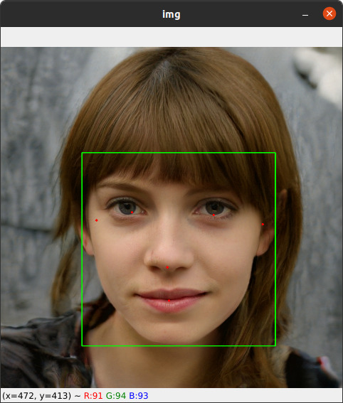
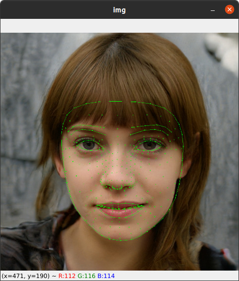

# FaceLandMarks

## Install requirements

```shell
pip install -r requirements.txt
```

## How to use

### Call Constructor

**Use image from path**
```python
fm = FaceLandMarks(img="test/1.jpg")
```
**or use loaded image**
```python
fm= FaceLandMarks(image=yourImage)
```
### Get Basics facial landmarks

```python
ans=fm.face_points()
FaceLandMarks.show_image(img=ans["output_img"])
```
<br/>

**Output Object**
_2D Points_
```json
{
    "origin_img": <Your input image>,
    "output_img": <Image like above>,
    "landmarks": [
        "label_id":<Int>,
        "score": <float>,
        "location_data" :{
          "relative_bounding_box": {
            "xmin": <float>
            "ymin": <float>
            "width": <float>
            "height": <float>
          },
          "relative_keypoints" :{
            x: <float>
            y: <float>
          },
          ...
        } 
        ...
      ]
}
```


### Get full facial landmarks

```python
    ans = fm.face_mesh()
    FaceLandMarks.show_image(img=ans["output_img"])
```
<br/>

**Output Object**
_3D Points_
```json
{
    "origin_img": <Your input image>,
    "output_img": <Image like above>,
    "landmarks": [
        "landmark":{
            x: <float>,
            y: <float>,
            z: <float>
          }
          ...
      ]
}
```
### Helper Functions

**Show Image**
```python
FaceLandMarks.show_image(img=fm.image)
```
*or*
```python
FaceLandMarks.show_image(path="test/1.jpg")
```
**Load Image**
```python
FaceLandMarks.load_image("test/1.jpg")
```

