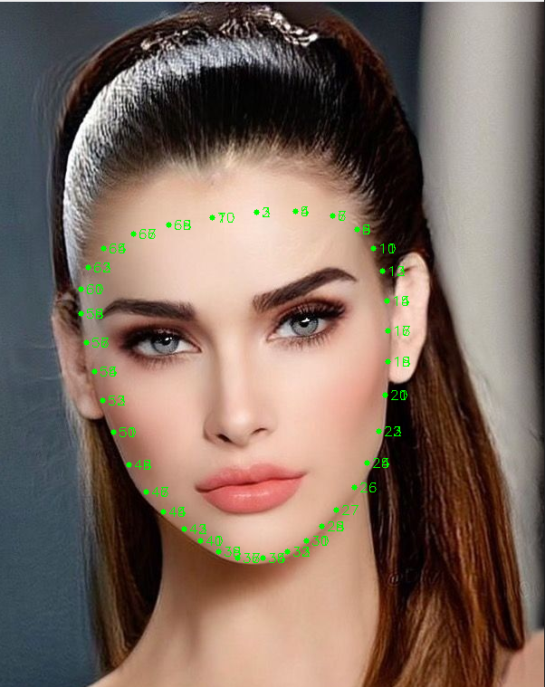
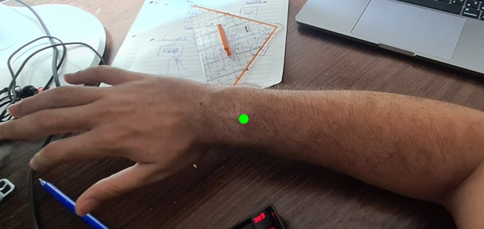

# AI AR Server


## Run this project using docker-compose

Inside the root project you can run

```shell
sudo docker-compose build
```

and then run the following to start the container and expose the API:

```shell
sudo docker-compose up
```
---
# Api documentation

## All requests saved in Postman:

[](https://documenter.getpostman.com/view/8476530/Tzz4RzBS)

---

## Api route:

- **http://0.0.0.0:5000/maskImage** _[Post]_
- **http://0.0.0.0:5000/maskImage** _[Post]_


    Note that you should send image as base64 string

---

##maskImage:
### Parameters:

-image

#### The following you can ignore and only send what you need

- face_oval
- left_eye
- right_eye
- left_eye_brow 
- right_eye_brow 

**For example if you need only face_oval and left_eye :**

_C# example we send only face_oval and left_eye and ignore others_


### response example:


```json
{
    "Points": {
        "face_oval": [
            [
                368.0,
                153.0
            ],
            .
            .
            .
            [
                368.0,
                153.0
            ]
        ],
        "left_eye": [
            [
                575.0,
                223.0
            ],
            .
            .
            .
            [
                467.0,
                236.0
            ]
        ]
    }
}
```
- each array element contain x,y pixel position
_Note that we send image in Base64_

## Points(left_eye) example on image:


## Points(face_oval) example on image:



---

## wrist (V0):
    In this version you should provide image like next image in hand position

### wrist phases:
- [x] Provide normal wrist image (range .5~1m) like next image  
- [ ] Wrist in any range from camera  
- [ ] Remove fake hand palm point
- [ ] Left or right
- [ ] any rotation angle

### Parameters:

-image


### response example:


```json
{
    "Points": [
        364,
        337
    ]
}
```
- each array element contain x,y pixel position
_Note that we send image in Base64_

## Points(wrist) example on image:



---


<!-- ROADMAP -->
## Roadmap

See the [open issues](https://github.com/yousefmasry4/Machine-Learning-Core/issues) for a list of proposed features (and known issues).

---

<!-- CONTRIBUTING -->
## Contributing

Contributions are what make the open source community such an amazing place to be learn, inspire, and create. Any contributions you make are **greatly appreciated**.

1. Fork the Project
2. Create your Feature Branch (`git checkout -b yousefmasry4/Machine-Learning-Core`)
3. Commit your Changes (`git commit -m 'Add some AmazingFeature'`)
4. Push to the Branch (`git push origin yousefmasry4/Machine-Learning-Core`)
5. Open a Pull Request

---

<!-- LICENSE -->
## License

Distributed under the MIT License. See `LICENSE` for more information.


